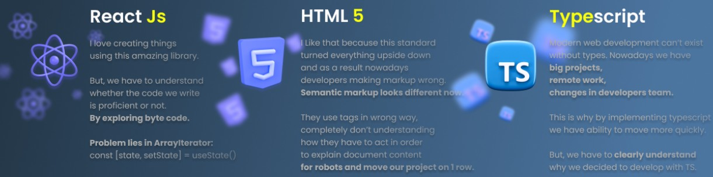
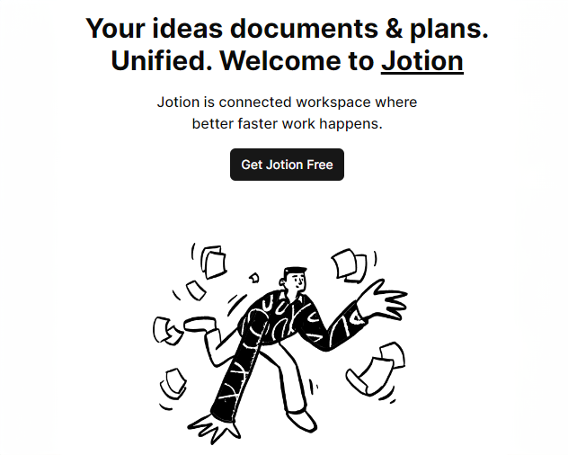

    
    

      <!-- Top image -->
      <table
        cellspacing="0"
        cellpadding="0"
        style="
          max-width: 600px;
          width: 100%;
          padding-bottom: 24px;
          font-family: 'Poppins', sans-serif;
        "
      >
        <tbody>
          <tr>
            <td>
              
            </td>
          </tr>
        </tbody>
      </table>
      <!-- Top image -->

      <!-- Greeting section -->
      <table
        cellspacing="0"
        cellpadding="0"
        style="max-width: 600px; width: 100%"
      >
        <tbody>
          <tr>
            <td>
              

                Hi!
                <a
                  href="https://www.ignition-interactive.com/#"
                  style="color: #1a1a1a"
                  >Ignition Interactive</a
                >
              

            </td>
          </tr>
          <tr>
            <td>
              

                I would like apply to position
                <a
                  href="https://www.olx.pl/oferta/praca/frontend-react-developer-CID4-IDYjxvv.html"
                  style="color: #1a1a1a"
                  >Front-end developer.</a
                >
              

            </td>
          </tr>
        </tbody>
      </table>
      <!-- Greeting section -->

      <!-- About me section -->
      <table
        cellspacing="0"
        cellpadding="0"
        style="
          max-width: 600px;
          width: 100%;
          font-family: 'Poppins', sans-serif;
        "
      >
        <tbody>
          <tr>
            <td style="text-align: left" class="about_description">
              <table cellspacing="0" cellpadding="0" style="width: 100%;">
                <tbody>
                  <tr>
                    <td>
                      <table cellspacing="0" cellpadding="0" style="width: 100%;">
                        <tr>
                          <td style="width: 70%">
                            
                              About me
                            
                          </td>
                          <td align="right" style="width: 30%">
                            
                          </td>
                        </tr>
                      </table>
                    </td>
                  </tr>
                  <tr>
                    <td>
                      

                        I have 2 years of experience as a React Developer.
                         
                        At work, I am responsible for:  
                        -training other team members 
                        -build API routes 
                        -developing CMS, Admin Page, Complex Forms using React,
                        Typescript, NextJs, NodeJs, React Hook Form, Zustand and
                        some UI libraries.
                      

                    </td>
                  </tr>
                </tbody>
              </table>
            </td>
            <td class="about_image">
              
            </td>
          </tr>
        </tbody>
      </table>
      <!-- About me section -->

      <!-- Explore latest work -->
      <table
        cellspacing="0"
        cellpadding="0"
        style="
          max-width: 600px;
          width: 100%;
          font-family: 'Poppins', sans-serif;
        "
      >
        <tbody>
          <tr>
            <td style="padding-bottom: 24px; text-align: left">
              <table cellspacing="0" cellpadding="0">
                <tbody>
                  <tr>
                    <td>
                      <h3 style="font-size: 30px; font-weight: 500; margin: 0">
                        Explore my latest work
                      </h3>
                    </td>
                  </tr>
                  <tr>
                    <td>
                      

                        Check out my recent projects I am passionate about!
                      

                    </td>
                  </tr>
                </tbody>
              </table>
            </td>
          </tr>
        </tbody>
        <tbody class="projects_desktop" style="display: block">
          <tr>
            <td style="padding-bottom: 12px">
              <table cellspacing="0" cellpadding="0">
                <tbody>
                  <tr>
                    <td class="project_image" width="50%">
                      
                    </td>
                    <td
                      class="project_description"
                      width="50%"
                      style="padding: 12px; vertical-align: top"
                    >
                      

                        <a
                          href="https://github.com/DemaPy/Notion-Clone"
                          target="_blank"
                          style="color: #1a1a1a"
                          >Jotion</a
                        >
                      

                      

                        Your ideas documents & plans. Unified. Organize your
                        life with Jotion
                      

                       
                      <table cellspacing="0" cellpadding="0">
                        <tr>
                          <td style="padding-right: 12px">
                            
                          </td>
                          <td style="padding-right: 12px">
                            
                          </td>
                          <td style="padding-right: 12px">
                            
                          </td>
                          <td>
                            
                          </td>
                        </tr>
                      </table>
                    </td>
                  </tr>
                </tbody>
              </table>
            </td>
          </tr>
          <tr>
            <td>
              <table cellspacing="0" cellpadding="0">
                <tbody>
                  <tr>
                    <td
                      class="project_description"
                      width="50%"
                      style="padding: 12px; vertical-align: top"
                    >
                      

                        <a
                          href="https://github.com/DemaPy/DeMarketplace"
                          target="_blank"
                          style="color: #1a1a1a"
                          >Demarketplace</a
                        >
                      

                      

                        Welcome to DeMaplace. Every asset is verified by our
                        team of specialists to ensure in quality.
                      

                       
                      <table cellspacing="0" cellpadding="0">
                        <tr>
                          <td style="padding-right: 12px">
                            
                          </td>
                          <td style="padding-right: 12px">
                            
                          </td>
                          <td style="padding-right: 12px">
                            
                          </td>
                          <td>
                            
                          </td>
                        </tr>
                      </table>
                    </td>
                    <td class="project_image" width="50%">
                      
                    </td>
                  </tr>
                </tbody>
              </table>
            </td>
          </tr>
        </tbody>
        <tbody class="projects_mobile" style="display: none">
          <tr>
            <td>
              <table cellspacing="0" cellpadding="0">
                <tbody>
                  <tr>
                    <td class="project_image" width="50%">
                      
                    </td>
                    <td
                      class="project_description"
                      width="50%"
                      style="padding: 12px; vertical-align: top"
                    >
                      

                        <a
                          href="https://github.com/DemaPy/Notion-Clone"
                          target="_blank"
                          style="color: #1a1a1a"
                          >Jotion</a
                        >
                      

                      

                        Your ideas documents & plans. Unified. Organize your
                        life with Jotion
                      

                       
                      <table cellspacing="0" cellpadding="0">
                        <tr>
                          <td style="padding-right: 12px">
                            
                          </td>
                          <td style="padding-right: 12px">
                            
                          </td>
                          <td style="padding-right: 12px">
                            
                          </td>
                          <td>
                            
                          </td>
                        </tr>
                      </table>
                    </td>
                  </tr>
                </tbody>
              </table>
            </td>
          </tr>
          <tr>
            <td>
              <table cellspacing="0" cellpadding="0">
                <tbody>
                  <tr>
                    <td class="project_image" width="50%">
                      
                    </td>
                    <td
                      class="project_description"
                      width="50%"
                      style="padding: 12px; vertical-align: top"
                    >
                      

                        <a
                          href="https://github.com/DemaPy/DeMarketplace"
                          target="_blank"
                          style="color: #1a1a1a"
                          >Demarketplace</a
                        >
                      

                      

                        Welcome to DeMaplace. Every asset is verified by our
                        team of specialists to ensure in quality.
                      

                       
                      <table cellspacing="0" cellpadding="0">
                        <tr>
                          <td style="padding-right: 12px">
                            
                          </td>
                          <td style="padding-right: 12px">
                            
                          </td>
                          <td style="padding-right: 12px">
                            
                          </td>
                          <td>
                            
                          </td>
                        </tr>
                      </table>
                    </td>
                  </tr>
                </tbody>
              </table>
            </td>
          </tr>
        </tbody>
      </table>
     

